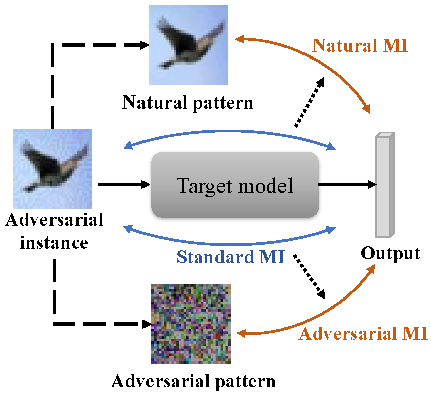
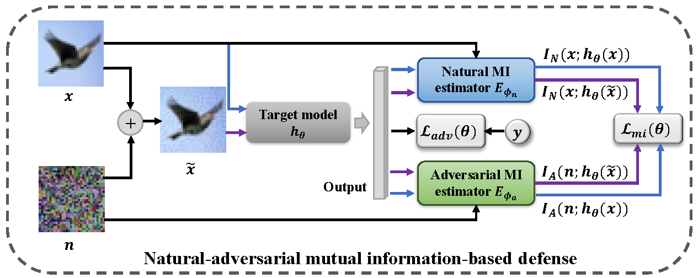

<div align="center">   
  
# Improving Adversarial Robustness via Mutual Information Estimation
[](https://proceedings.mlr.press/v162/zhou22j/zhou22j.pdf)

</div>


The implementation of [Improving Adversarial Robustness via Mutual Information Estimation](https://proceedings.mlr.press/v162/zhou22j/zhou22j.pdf) (ICML 2022).

Deep neural networks (DNNs) are found to be vulnerable to adversarial noise. They are typically misled by adversarial samples to make wrong predictions.
To alleviate this negative effect, in this paper, we investigate the dependence between outputs of the target model and input adversarial samples from the perspective of information theory, and propose an adversarial defense method. Specifically, we first measure the dependence by estimating the mutual information (MI) between outputs and the natural patterns of inputs (called *natural MI*) and MI between outputs and the adversarial patterns of inputs (called *adversarial MI*), respectively. We find that adversarial samples usually have larger adversarial MI and smaller natural MI compared with those w.r.t. natural samples. Motivated by this observation, we propose to enhance the adversarial robustness by maximizing the natural MI and minimizing the adversarial MI during the training process. In this way, the target model is expected to pay more attention to the natural pattern that contains objective semantics. Empirical evaluations demonstrate that our method could effectively improve the adversarial accuracy against multiple attacks.


<p float="left" align="center">
 
<figcaption align="center">
A visual illustration of disentangling the standard MI into the natural MI and the adversarial MI. The longdash lines show that the adversarial sample is disassembled into the natural pattern (derived from the natural sample) and the adversarial pattern (derived from the adversarial noise). The dotted lines denote the operation of disentangling the standard MI into the natural MI and the adversarial MI.
</figcaption>
</p>


<p float="left" align="center">
 
<figcaption align="center">
The overview of our proposed Natural-Adversarial Mutual Information-based Defense (NAMID) method.
</figcaption>
</p>


## Requirements
- This codebase is written for `python3` and 'pytorch'.
- To install necessary python packages, run `pip install -r requirements.txt`.


## Experiments
### Data
- Please download and place all datasets into the data directory. 


### Training
To train the standard AT model

```
python train_standard.py --model_dir 'your checkpoint directory for the target model'
```

To train the estimator of MI (two types of methods)

```
python train_MI_estimator.py --model_dir 'your checkpoint directory for MI estimator'
```

or 

```
python train_MI_estimator_only_max.py --model_dir 'your checkpoint directory for MI estimator'
```

More references on learning MI: 
1. [Learning Adversarially Robust Representations via Worst-Case Mutual Information Maximization](https://github.com/schzhu/learning-adversarially-robust-representations)
2. [Learning-Disentangled-Representations-via-Mutual-Information-Estimation](https://github.com/MehdiZouitine/Learning-Disentangled-Representations-via-Mutual-Information-Estimation)
3. [DeepInfomaxPytorch](https://github.com/DuaneNielsen/DeepInfomaxPytorch)
4. [DIM](https://github.com/rdevon/DIM)

To train the target model using NAMID

```
python train_MIAT.py --model_dir 'your checkpoint directory for the target model'
```


### Test
To test the learned target model

```
python test_comparison.py --model_dir 'your checkpoint directory for the target model'
```


## License and Contributing
- This README is formatted based on [paperswithcode](https://github.com/paperswithcode/releasing-research-code).
- Feel free to post issues via Github. 


## Reference
If you find the code useful in your research, please consider citing our paper:


<pre>
@inproceedings{zhou2022improving,
  title={Improving Adversarial Robustness via Mutual Information Estimation},
  author={Zhou, Dawei and Wang, Nannan and Gao, Xinbo and Han, Bo and Wang, Xiaoyu and Zhan, Yibing and Liu, Tongliang},
  booktitle={International Conference on Machine Learning},
  pages={27338--27352},
  year={2022},
  organization={PMLR}
}
</pre>
